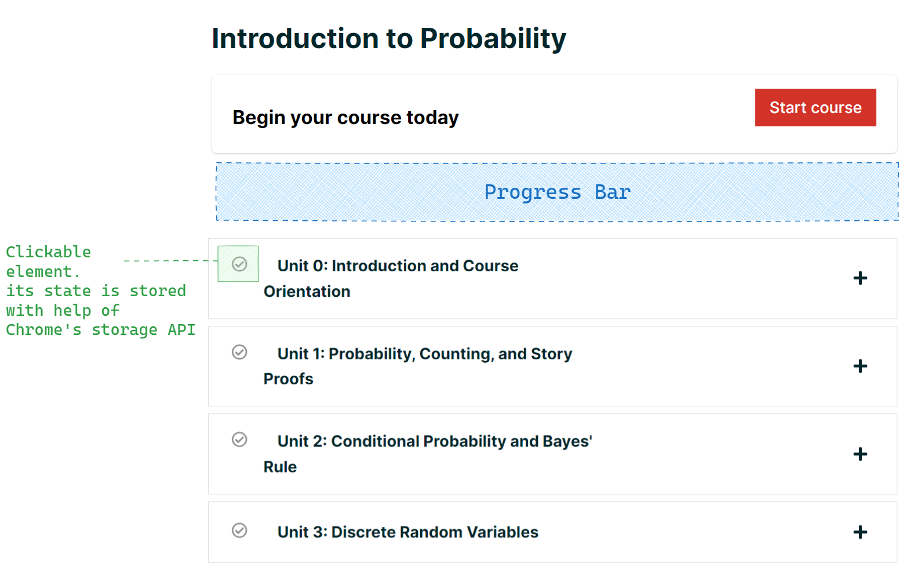
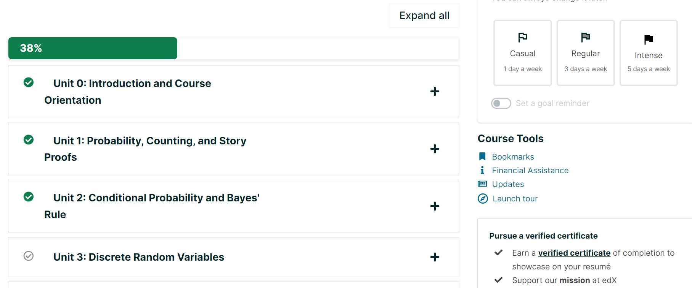

# Chrome Extension: EdX Manual Progress

The idea crossed my mind when I was taking an archived course at EdX, and since it's old and unmaintained, you can't answer the quiz exercices, thus your progress is not automatically tracked.
**My goal is to let the user manually track their progress.**

## Plan

## Result

## Tasks
- [x] Add event listners (click event)
- [x] Expierement with storage API and store the data of one website
- [x] Fix how the data is stored
- [x] Add a progress bar
- [ ] Refactoring
